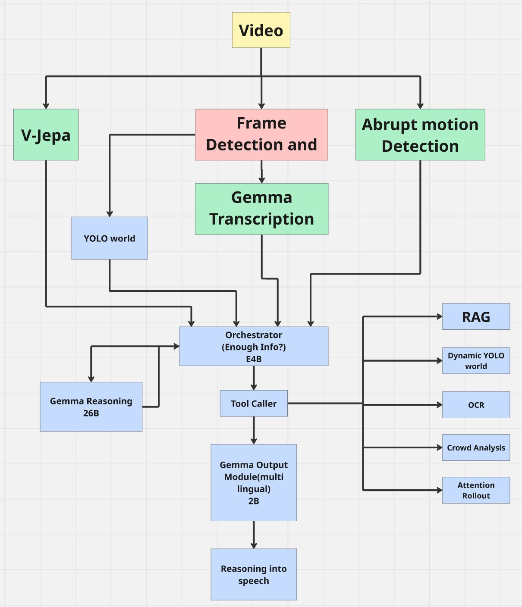

# Agentic Multi-Modal Video Safety Surveillance System

## Overview

This project is an AI-powered surveillance system that analyzes CCTV videos to detect suspicious activities and generate detailed incident reports automatically.

Unlike traditional surveillance systems that rely only on object detection, this project combines anomaly detection, object detection, scene understanding, motion analysis, and agentic reasoning to understand what is happening inside a video.

The entire workflow is implemented using a multi-agent architecture built with LangGraph.

---

## Features

- Video anomaly detection using V-JEPA2
- Object detection using YOLO-World
- Scene understanding using Gemma 4 Vision
- Abrupt motion detection
- Dynamic object detection
- OCR for text extraction
- Crowd behaviour analysis
- Hybrid RAG + Knowledge Graph retrieval
- Agentic decision making using LangGraph
- Automatic incident report generation
- React + FastAPI web application

---

## Project Architecture

The following diagram illustrates the complete workflow of the **Agentic Multi-Modal Video Safety Surveillance System**.

<p align="center">
  
</p>

### Architecture Description

The uploaded surveillance video is processed through three parallel perception modules:

- **V-JEPA2** performs anomaly detection by identifying unusual events in the video.
- **Frame Detection and Extraction** selects important frames, which are then analyzed by:
  - **YOLO-World** for predefined object detection.
  - **Gemma 4 12B** for detailed scene transcription.
- **Abrupt Motion Detection** identifies sudden movements and unusual motion patterns.

The outputs from all these modules are combined and sent to the **Orchestrator Agent (Gemma 4 4B)**.

The Orchestrator evaluates whether enough information has been collected to understand the incident.

- If additional reasoning is required, it invokes the **Gemma 4 26B Reasoning Agent**.
- If more visual evidence is needed, it uses the **Tool Caller** to execute specialized tools such as:
  - Hybrid RAG
  - Dynamic YOLO-World
  - OCR
  - Crowd Analysis
  - Attention Rollout

After collecting all the required evidence, the system generates the final multilingual incident report through the **Gemma Output Module**.
## Workflow

1. User uploads a surveillance video.
2. Frames are extracted from the video.
3. Multiple AI models analyze the video simultaneously.
4. Results are collected by the Orchestrator Agent.
5. The Orchestrator decides whether more analysis is required.
6. If needed, additional tools are executed.
7. The Reasoning Agent analyzes all collected evidence.
8. A final incident report is generated.

---

## AI Models Used

| Task | Model |
|------|------|
| Video Anomaly Detection | V-JEPA2 |
| Object Detection | YOLO-World |
| Scene Transcription | Gemma 4 12B |
| Orchestrator Agent | Gemma 4 4B |
| Reasoning Agent | Gemma 4 26B |
| Embeddings | EmbeddingGemma |

---

## Tools Used

- Dynamic YOLO Detection
- OCR
- Crowd Analysis
- Hybrid RAG
- Knowledge Graph
- Attention Rollout

---

## Technology Stack

### Backend

- Python
- FastAPI
- LangGraph
- LangChain
- PyTorch

### Frontend

- React
- Vite
- TypeScript

### Computer Vision

- OpenCV
- YOLO-World
- V-JEPA2
- EasyOCR

### Database

- LanceDB
- Knowledge Graph

---

## Project Structure

```
project/

│── backend/
│── frontend/
│── graph/
│── services/
│── rag/
│── vectorstore/
│── storage/
│── README.md
```

---

## Installation

Clone the repository

```bash
git clone <repository-url>
```

Move into the project directory

```bash
cd project
```

Install backend dependencies

```bash
pip install -r requirements.txt
```

Install frontend dependencies

```bash
cd frontend
npm install
```

---

## Running the Project

Start the backend

```bash
uvicorn main:app --reload
```

Start the frontend

```bash
npm run dev
```

Open the application in your browser.

---

## Future Scope

- Multi-camera support
- Real-time CCTV monitoring
- Face recognition
- Person re-identification
- Vehicle tracking
- Edge deployment
- Automatic emergency alerts
- Multi-language reporting

---

## Contributors

- **Piyush Kumar Verma**
- **Mayank Verma**
- **Sidharth Bharti**
- **Shahzeb Ali**

---

## License

This project is developed for educational and research purposes.
